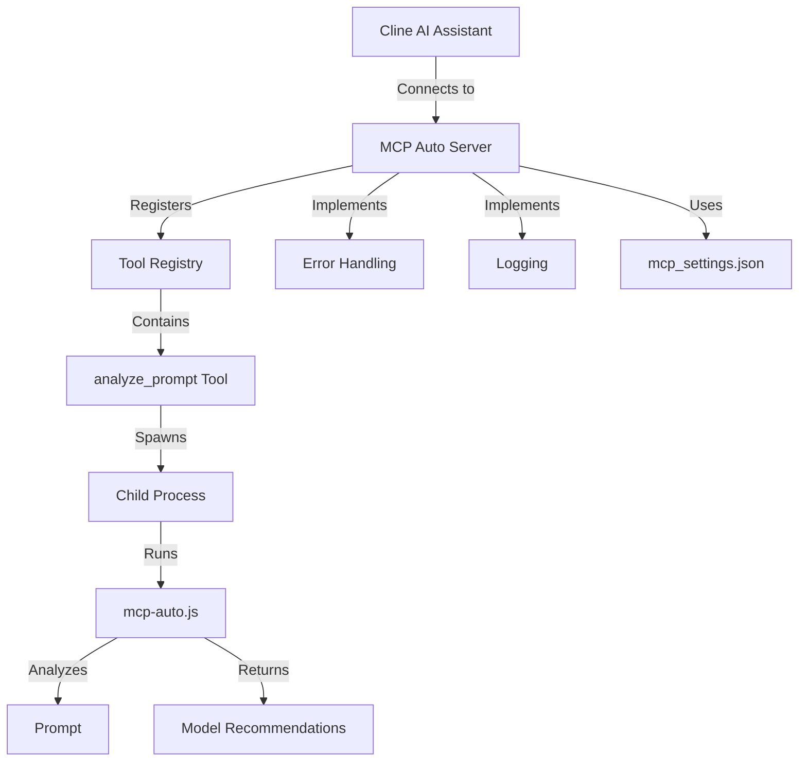
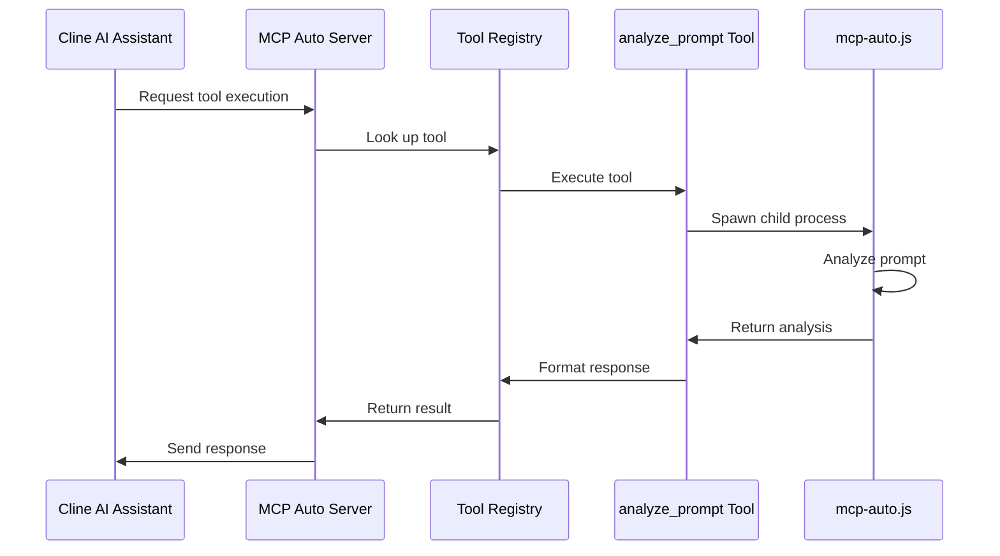

# MCP Auto Server Architecture

## System Architecture Overview

The MCP Auto Server is designed to provide LLM selection capabilities to AI assistants and other MCP-compatible tools. It implements the Model Context Protocol (MCP) to ensure seamless integration and interoperability.

The key components of the system include:

-   **Server Core:** Handles incoming requests, manages tool execution, and formats responses according to the MCP specification.
-   **Tool Registry:** Maintains a registry of available tools, including the `analyze_prompt` tool.
-   **analyze\_prompt Tool:** Analyzes input prompts and recommends the most suitable LLM models based on cost efficiency and performance criteria.
-   **mcp-auto.js:** Contains the core LLM selection logic and algorithms.
-   **mcp\_settings.json:** Stores server configuration settings, such as rate limiting and caching options.

## Component Breakdown and Responsibilities

### Server Core

The Server Core is responsible for handling incoming requests, managing tool execution, and formatting responses according to the MCP specification.

**Responsibilities:**

-   Implementing the MCP protocol.
-   Handling incoming HTTP requests.
-   Authenticating and authorizing requests.
-   Routing requests to the appropriate tools.
-   Formatting responses according to the MCP specification.
-   Implementing error handling and logging.

### Tool Registry

The Tool Registry maintains a registry of available tools, including the `analyze_prompt` tool.

**Responsibilities:**

-   Registering and managing available tools.
-   Validating tool requests.
-   Executing tools.
-   Providing tool metadata to clients.

### analyze\_prompt Tool

The `analyze_prompt` tool analyzes input prompts and recommends the most suitable LLM models based on cost efficiency and performance criteria.

**Responsibilities:**

-   Receiving input prompts.
-   Analyzing the prompts using the logic in `mcp-auto.js`.
-   Recommending the most suitable LLM models.
-   Formatting the results according to the MCP specification.

### mcp-auto.js

The `mcp-auto.js` file contains the core LLM selection logic and algorithms.

**Responsibilities:**

-   Implementing the LLM selection logic.
-   Maintaining the LLM model database.
-   Estimating token counts.
-   Analyzing prompt characteristics.
-   Recommending optimal LLM models.

### Error Handling

The MCP Auto Server implements a combination of global handlers and per-request error boundaries to ensure robust error handling.

**Responsibilities:**

-   Catching and handling unexpected errors.
-   Providing informative error messages to clients.
-   Preventing server crashes due to unhandled exceptions.

### Logging

The MCP Auto Server uses a custom logging solution to track server activity and errors.

**Responsibilities:**

-   Logging server events, such as requests, responses, and errors.
-   Providing detailed information for debugging and troubleshooting.
-   Storing logs in a structured format for analysis.

## Data Flow

The following sequence diagram illustrates the data flow for a typical request to the MCP Auto Server:

1.  The Cline AI Assistant sends a request to the MCP Auto Server to execute a tool (e.g., `analyze_prompt`).
2.  The MCP Auto Server looks up the requested tool in the Tool Registry.
3.  The Tool Registry executes the tool.
4.  The `analyze_prompt` tool spawns a child process to run `mcp-auto.js`.
5.  `mcp-auto.js` analyzes the input prompt and recommends the most suitable LLM models.
6.  The `analyze_prompt` tool formats the results according to the MCP specification.
7.  The Tool Registry returns the formatted response to the MCP Auto Server.
8.  The MCP Auto Server sends the response back to the Cline AI Assistant.

## Integration with MCP Protocol

The MCP Auto Server is fully compliant with the Model Context Protocol (MCP). It implements the required API endpoints and data formats.

**Key MCP Protocol Details:**

-   The server exposes the `/list_tools` endpoint to allow clients to discover available tools.
-   The server exposes the `/call_tool` endpoint to allow clients to execute tools.
-   The server uses JSON-RPC for request and response formatting.