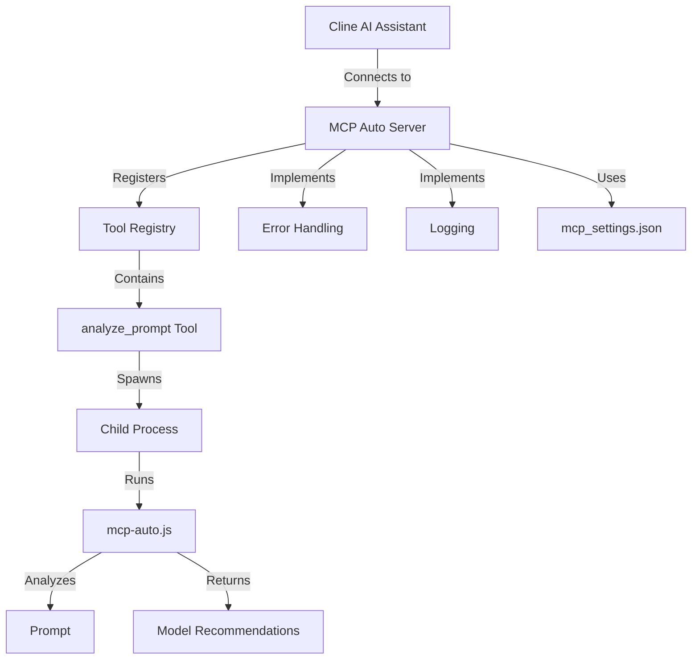
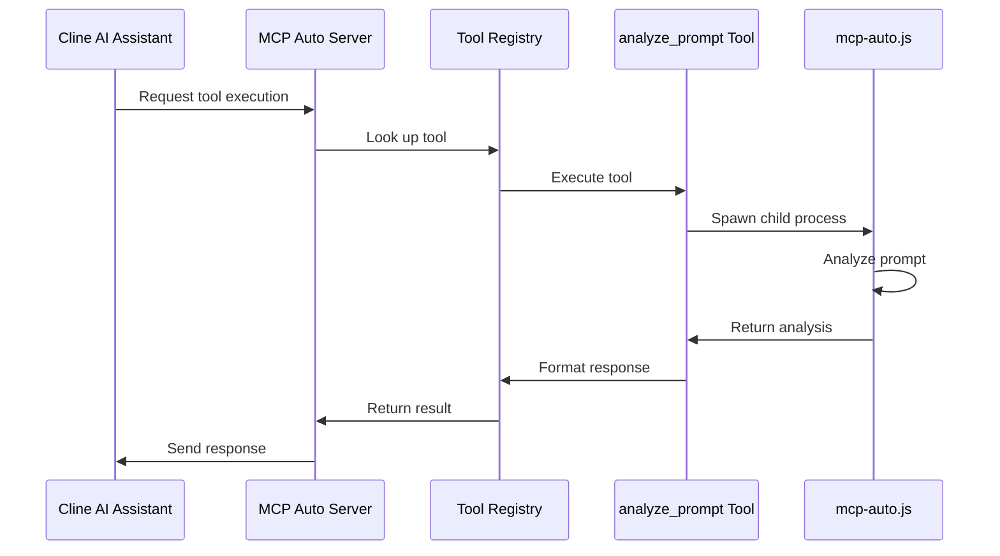

# Documentation Plan for MCP Auto Server

## 1. README.md Structure

### Project Overview and Purpose
- Introduction to the MCP Auto Server
- Explanation of the Model Context Protocol (MCP)
- Purpose: Helping AI assistants select optimal LLM models based on cost and performance
- Key features and benefits

### Installation Instructions
- Prerequisites (Node.js, npm)
- Installation steps
  - Clone repository
  - Install dependencies
  - Configuration setup
- Verification of installation

### Configuration Details
- Overview of mcp_settings.json
- Configuration options explanation
  - Rate limiting
  - Caching options
  - Other server settings
- Example configurations

### Usage Examples
- How to use with Cline AI assistant
- Example prompts and expected outputs
- Demonstration of analyze_prompt tool functionality

### API Documentation
- Tool description and parameters
- Input/output formats
- Error handling

### Troubleshooting Guide
- Common issues and solutions
- Logging and debugging
- Support resources

## 2. ARCHITECTURE.md Structure

### System Architecture Overview
- High-level architecture diagram
- MCP protocol implementation
- Key components

### Component Breakdown and Responsibilities
- Server Core
  - Protocol implementation
  - Request handling
  - Response formatting
- Tool Registry
  - Tool registration mechanism
  - Tool execution flow
  - Tool validation
- analyze_prompt Tool
  - Integration with mcp-auto.js
  - Input/output transformation
  - Performance considerations
- Error Handling
  - Global handlers
  - Per-request error boundaries
  - Error types and responses
- Logging
  - Custom logging solution
  - Log levels and formats
  - Log storage and rotation

### Data Flow
- Request flow diagram
- Data transformation process
- Response generation

### Integration with MCP Protocol
- Protocol compliance details
- Request/response formats
- Protocol extensions (if any)

## Implementation Plan

1. Create README.md
   - Write all sections as outlined above
   - Include code examples and screenshots where appropriate
   - Ensure clear and concise instructions

2. Create ARCHITECTURE.md
   - Develop detailed architecture documentation
   - Create and include diagrams
   - Document technical implementation details

3. Review and Finalize
   - Ensure documentation is comprehensive and accurate
   - Check for clarity and readability
   - Verify all examples work as described